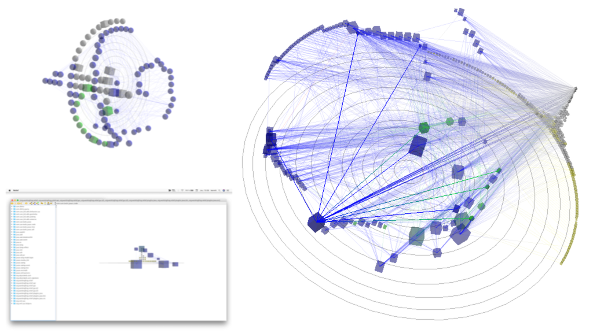
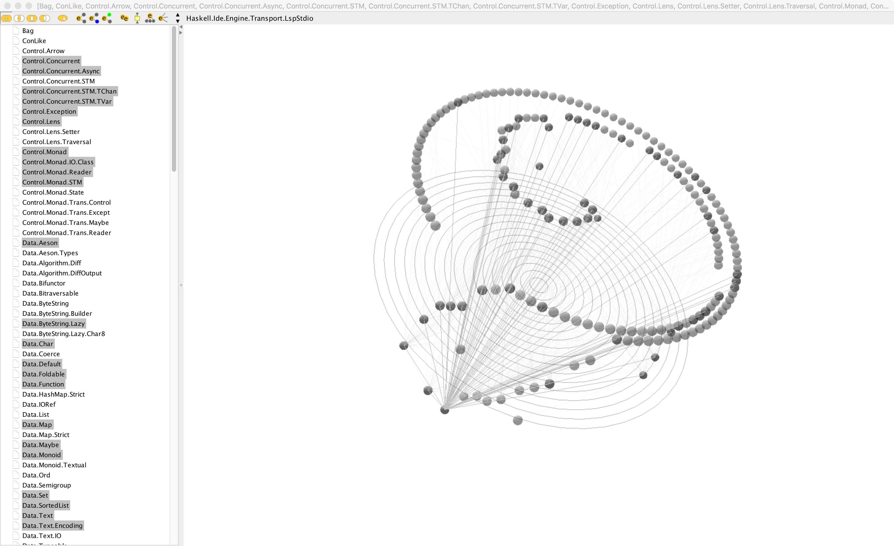

# Portfolio
## Java

Relief, an Open Source software I designed and implemented. It is a Java source code and bytecode parser displaying relevant data in a 3D analysis tool.  

## Haskell
### Bridging Java and Haskell through Eta

Proof of Concept of a Haskell project parser reusing the 3D analysis tool of Relief through Eta (https://eta-lang.org/).  

### Playing with graphs
A [solution](https://github.com/jhenligne/shoreline) to a job offer problem by [Shoreline](https://shorelinesoftware.com/software-engineer-language/) 

### Parsing the Market Data Feed
A solution to a job offer code sample from [Tsuru Capital](https://www.tsurucapital.com/en/code-sample.html)  
This job offer is still active so I will provide source code to any employer asking for it (jhderaigniac [@] protonmail [.] com)  

More details in my [Twitter posts](https://twitter.com/JHRaigniac) and in my [LinkedIn profile](https://www.linkedin.com/in/jean-hugues-de-raigniac/en)  
